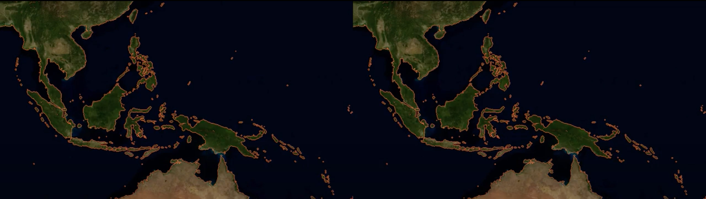

# Number of Islands

This tool analyzes geospatial raster imagery to identify the number and location of distinct islands. The grid is iteratively traversed pixel by pixel until land is hit, triggering one of the search algorithms to 'visit' the contiguous land before returning to the search.

[Visualization of the DFS' and BFS variants](https://youtu.be/kEoZuNdHLas)

### Average Execution Times (seconds) across 5 trials

|                   | Depth First Search | Depth First Search' | Breadth First Search |
|-------------------|--------------------|---------------------|----------------------|
| 426 x 240 (240p)  | 0.562              | 0.534               | 0.534                |
| 854 x 480 (480p)  | -                  | 2.232               | 2.540                |
| 1280 x 720 (720p) | -                  | 8.720               | 8.528                |
| 1800 x 3600       | -                  | 41.965               | 42.225               |

Depth First Search uses recursion to make use of the call stack to save memory. It is therefore limited by Python's recursion limit and will fail on large datasets.

Depth First Search' uses an in-memory last-in-first-out stack. It is typically the fastest search algorithm for this type of analysis.

Breadth First Search uses an in-memory first-in-first out queue.

### Use

An example of the use of the NumberOfIslands module can be seen in analysis.py

### Development

Analysis performed on Blue Marble dataset, courtesy of NASA.

Dependencies: 
* NumPy
* Rasterio

Video compiled with ffmpeg.
